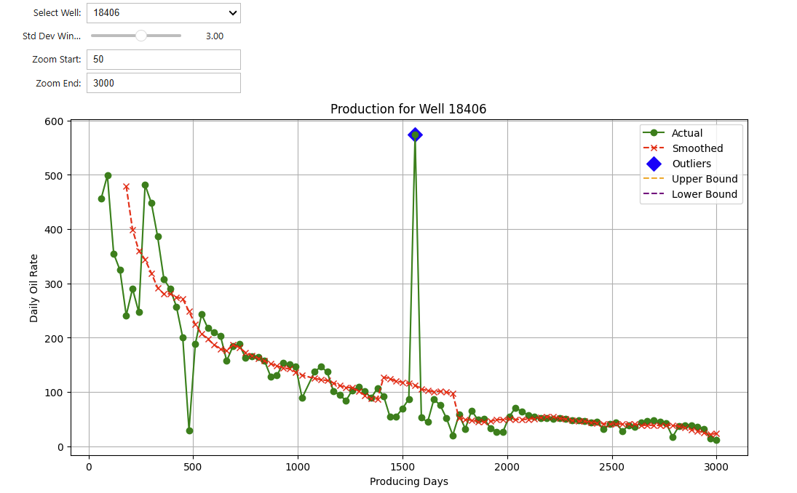

# Oil and Gas Production Analytics Workflow

## Overview
The **Oil and Gas Production Analytics Workflow** is an end-to-end Python-based solution for collecting, analyzing, and forecasting oil and gas production data. This project showcases skills in creative way to get data, data engineering, exploratory analysis, and machine learning modeling, designed for those curious about oil and gas.

---

## Features
- **Scraping**: Automates data extraction for well header and production data from North Dakota State website.
- **Data Cleaning**: Cleans and preprocesses the data for analysis.
- **Exploratory Analysis**: Provides insights into production trends and operational efficiency.
- **Forecasting**: Implements machine learning models and DCA to predict future production values.
- **Reproducible Workflow**: Organized structure for easy navigation and extension.

---

## Installation

## Option 1: Using Virtual Environment**
1. **Clone the repository**:
   ```bash
   git clone https://github.com/Jalley22/Oil-and-Gas-Production-Analytics-Workflow.git
   cd Oil-and-Gas-Production-Analytics-Workflow
   
2. **Set up a virtual environment:**
   python -m venv venv
   source venv/bin/activate  # On Windows: venv\Scripts\activate
   pip install -r requirements.txt

3. **Run the script to get data:**
   python src/get_data/scrape_production_data.py

## Option 2: Using Conda Environment**
1. **Clone the repository**:
   ```bash
   git clone https://github.com/Jalley22/Oil-and-Gas-Production-Analytics-Workflow.git
   cd Oil-and-Gas-Production-Analytics-Workflow
   
2. **Create and activate a Conda environment:**
   conda env create -f env_312.yml
   conda activate oil_and_gas_production_workflow

3. **Run the script to get data:**
   python src/get_data/scrape_production_data.py

## Usage

1. **Get the Data**
   - The scraper collects well header and production data for a specified operator.
   - Upon running the script:
     - Input the operator name when prompted.
     - Alternatively, select from the available options.
   - **Output**: raw CSV files are stored in the `data/raw` directory.

2. **Analyze the Data**
   - Use the Jupyter notebooks provided in the `notebooks/` directory for exploratory data analysis.
   - Visualize production trends and identify potential anomalies using interactive widgets and plots.

3. **Forecast Production**
   - Use the prepared data to build machine learning models.
   - Example models and scripts are provided in the `forecasting/` directory to predict future production values.
  
  ---

  ## Folder Structure
  ```plaintext
  Oil-and-Gas-Production-Analytics-Workflow/
|
├── data/                   # Scraped data files
├── notebooks/              # Jupyter notebooks for data exploration
├── src/
│   ├── get_data/           # Web scraping scripts
│   ├── analysis/           # Data cleaning and EDA scripts
│   ├── forecasting/        # Forecasting models and scripts
│
├── assets/                 # Static files (images, plots, etc.)
├── venv/                   # Virtual environment files
├── requirements.txt        # Python dependencies
└── README.md               # Project documentation
```


## Key Libraries
- **Scraping**: BeautifulSoup, requests
- **Data Manipulation**: pandas, numpy
- **Visualization**: matplotlib, seaborn
- **Machine Learning**: scikit-learn

---
## Example Visuals
### Example Widget
Here's an example of the interactive widget used for exploring outliers for specific well's production profile.


---

## Contributions and Future Work
I welcome contributions! Some areas for enhancement include:
- Expanding the scraper for additional data sources (Texas, etc.).
- Adding advanced machine learning models for forecasting.
- Visualizing results with interactive dashboards (e.g., Plotly, Dash).
